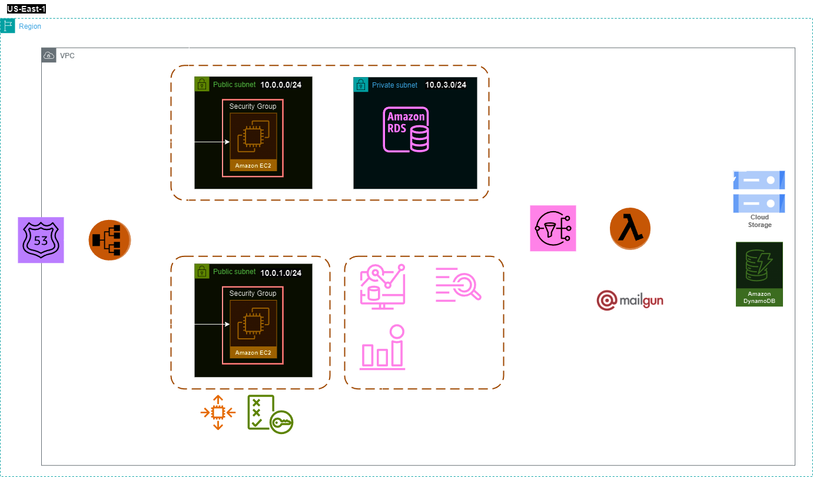

# Infrastructure as Code for a webapp

AWS Infrastructure as code using pulumi for AWS and GCP

## Table of Contents

- [IAC for webapp](#iac-webapp)
  - [Table of Contents](#table-of-contents)
  - [Infrastructure Diagram](#infrastructure-diagram)
  - [Prerequisites](#prerequisites)
  - [Getting Started](#getting-started)
    - [Installation](#installation)
    - [Configuration](#configuration)
  - [Architecture Components](#architecture-components)
  - [Networking](#networking)
  - [Usage](#usage)
  - [License](#license)

## Infrastructure Diagram


## Architecture Components

## Application Setup
Before launching our application on cloud using Pulumi, let's configure our DNS, Email server, and SSL certificates [here](./SETUP.md)

### Prerequisites
The following versions were the latest when I started the project. You could upgrade them as per requirements.
- Node.js v18.x
- Pulumi v3.87.0
- AWS CLI v2.13.24
- AWS Account
- GCP Account

## Getting Started with Pulumi

### Project Creation

```bash
# Create a new pulumi project in JavaScript
pulumi new aws-javascript

# Create a stck
pulumi stack init <stackname>

# Set AWS profile and region
pulumi config set aws:profile <profilename>
pulumi config set aws:region <your-region>
```

### Configuration
Create a profilename.stackname.yaml and add the following variables:
```yaml
config:
  aws:profile: dev
  aws:region: us-east-1
  gcp:project: csye6225-demo-406318
  gcp:zone: us-east1
  webapp:appGroup: "csye6225"
  webapp:appPassword: "csye6225"
  webapp:appUser: "csye6225"
  webapp:ebsVolumeSize: "25"
  webapp:ebsVolumeType: "gp2"
  webapp:ec2InstanceType: t2.micro
  webapp:ec2Keypair: csye6225-demo-key
  webapp:gcsBucketName: "csye6225-webapp-demo"
  webapp:hostedZone: "app.sudarshankudli.me"
  webapp:maxAllowedAzs: "3"
  webapp:project: webapp
  webapp:rdsDB: "csye6225"
  webapp:rdsPassword: "csye6225"
  webapp:rdsUser: "csye6225"
  webapp:serverPort: "8000"
  webapp:vpcCidrBlock: 10.0.0.0/16
  webapp:emailApiKey: "*****" //paste your mailgun API key
  webapp:myDomain: "sudarshankudli.me" //domain from which emails are sent
  webapp:sslCertificateArn: "arn:aws:acm:us-east-1:*****" //paste your certificate arn
```

### Creating resources
Once you're ready with the setup, running `pulumi up` will bring up the required resources
> [!Tip]
> Take a cup of coffee ad sit back! it's gonna take a few minutes

## Networking
Our project is set up within a VPC to isolate and secure resources. Subnets are strategically defined to control traffic and enhance network segmentation.

- Subnets - One public and private subnet in every AZ given a region
- Route table - Every subnet must be associated with a route table. Private subnets are connected to private route table and public subnets to public route table.

Public route table configuration
| Destination | Target |
| :---   | :--- |
| VPC CIDR | local |
| 0.0.0.0/0 | igw  |

> [!IMPORTANT]
> Ensure to remove route to internet gateway for private route tables

### EC2 and other services
It's important to configure security groups for our application to talk to other services and secure access to it. We're using CloudWatch agent to send logs to CloudWatch. All logs are written to a file /var/log/webapp.log. When you configure the CloudWatch Agent to monitor log files, it essentially tails the log files for changes. The agent continuously scans the log files for new entries and sends those entries to CloudWatch Logs in near real-time. We're also using StatsD to collect metrics of the number of API requests. StatsD runs on port 8125 on udp protocol.

| Protocol | Destination | Port | Reason |
| :---   | :--- | :--- | :--- |
| tcp | 0.0.0.0/0 | 443 | Allow https traffic for CloudWatch logs |
| udp | 0.0.0.0/0 | 8125 | Allow udp for statsD |
| tcp | DBSecurityGroup | 5432 | Connect to RDS (Postgres) |

Inbound rules allow us to configure access to EC2, in our application we need tcp and ssh access for the load balancer.

| Protocol | Source | Port | Reason |
| :---   | :--- | :--- | :--- |
| tcp | LoadBalancerSecurityGroup | 8000 | Serve API requests on port 8000 (application port) |
| ssh | 0.0.0.0/0 | 22 | Allow ssh connections for debugging |

> [!TIP]
> SSH access is only for debugging. It must be removed afterwards

### Load Balancer
Load balancer is a public facing service as we want users to connect to our web application. Hence, we allow all Https incoming traffic and route them to EC2.

| Protocol | CIDR/Security Group | Port | Type |
| :---   | :--- | :--- | :--- |
| tcp | 0.0.0.0/0 | 443 | Inbound - Allow https connections from the internet |
| tcp | EC2SecurityGroup | 8000 | Outbound - Reverse proxy to route traffic to EC2 |

> [!TIP]
> You can add Http connections as well on port 80

## AMI and Snapshots
When you create an Amazon Machine Image (AMI) using Packer with Amazon Elastic Block Store (EBS) storage, Amazon EC2 automatically creates an EBS snapshot. This snapshot is essentially a point-in-time copy of the EBS volume attached to the instance used to create the AMI. They are managed by AWS and are stored in a highly durable and redundant manner within the AWS infrastructure. They are not directly exposed as objects in an S3 bucket, and users don't interact with the underlying storage mechanism. Below are some of the use cases.

> [!IMPORTANT]
> EBS snapshots are stored within the Amazon EBS service itself and costs $0.05/GB-month.

Some properties of EBS backup are as follows:
- Data Persistence - capture the state of the volumes at the time of the AMI creation.
- Reproducibility - provide a way to recreate the state of the EBS volume in the future. If the volume or the instance is terminated, the snapshot allows you to restore or create a new volume with the same data and configurations.
- Incremental Backups - snapshots are incremental, meaning that only the blocks that have changed since the last snapshot are stored.

> [!TIP]
> You could also configure the EC2 without a block storage
```bash
"block_device_mappings": [
  {
    "device_name": "/dev/sda1",
    "no_device": true
  }
]
```

## Logs, Metrics and Alarms
We'll cover the setup of logging, metrics collection, and auto-scaling. This setup involves tailing logs from EC2 instances, obtaining metrics about the number of requests for each API using StatsD, and creating CloudWatch Alarms to trigger Auto Scaling based on CPU utilization.

#### Configuring CloudWatch Logs Agent
Install the CloudWatch Logs Agent on your EC2 instances while building the AMI.
```bash
# Install Cloudwatch-Agent
wget https://amazoncloudwatch-agent.s3.amazonaws.com/debian/amd64/latest/amazon-cloudwatch-agent.deb
sudo dpkg -i -E ./amazon-cloudwatch-agent.deb
```

Create the CloudWatch Logs Agent configuration file (/opt/aws/amazon-cloudwatch-agent/bin/config.json) to tail your application logs.
```bash
# Copy config and start cloudwatch agent
sudo cp -f $APP_DIR/deployment/config.json /opt/aws/amazon-cloudwatch-agent/bin/config.json
```

```json
"agent": {
    "metrics_collection_interval": 10,
    "logfile": "/var/logs/amazon-cloudwatch-agent.log"
},
"logs": {
    "logs_collected": {
        "files": {
            "collect_list": [
                {
                    "file_path": "/var/log/webapp.log",
                    "log_group_name": "csye6225",
                    "log_stream_name": "webapp"
                }
            ]
        }
    },
    "log_stream_name": "cloudwatch_log_stream"
}
```

> [!NOTE]
> CloudWatch configuration file can be found [here](https://github.com/CSYE-6225-FALL23/webapp/blob/main/deployment/config.json)

#### Configuring CloudWatch Metrics and Auto Scaling
Edit the CloudWatch Agent configuration file to collect metrics from StatsD.
```json
...
"metrics": {
  "metrics_collected": {
    "statsd": {
      "service_address": ":8125",
      "metrics_collection_interval": 15,
      "metrics_aggregation_interval": 300
    }
  }
}
```

> [!TIP]
> Set the metric collection and aggregation intervals as required

#### Install Node-StatsD Module using npm
Install the node-statsd module in your Node.js application.
```bash
npm install node-statsd
```

#### Use StatsD in Your App
In your Node.js application, import and use the node-statsd module to increment metrics.
```bash
# Import the module
const StatsD = require("node-statsd");
const statsd = new StatsD({ host: "localhost", port: 8125 });

# Increment a metric
statsd.increment("api.request.createAssignment");
```

> [!TIP]
> StatsD increment takes 2 arguments, the name of metric and sample rate

#### Setting Up Auto Scaling Policies and Alarms
Create a new scaling policy based on CPU utilization and create CloudWatch Alarms that trigger based on CPU utilization.

Alarm for Scaling Out:
| Type | Value |
| :---   | :--- |
| Metric | CPUUtilization |
| Threshold | >5% |
| Action | Add 1 instance |

Alarm for Scaling In:
| Type | Value |
| :---   | :--- |
| Metric | CPUUtilization |
| Threshold | <3% |
| Action | Remove 1 instance |

## Cleanup
Running `pulumi destroy` will cleanup all the resources created by Pulumi.

> [!IMPORTANT]
> Note that **not** all services are created/deleted by Pulumi automatically. Some are created manually and others by AWS for us. Deleting these resources is our responsibility to avoid charges.

Services which may charge you
- Route53 - Delete the records followed by the hosted zone
- Snapshots - EBS snapshots standard storage costs

Other resources which do not incur cost
- SSL Certificates - Public SSL/TLS certificates provisioned through AWS Certificate Manager are free
- AMI's - AMI's itself are not chargable but the EBS associated with it will be

## License
This project is licensed under the MIT License. See the [LICENSE](.\LICENSE) file for details.
